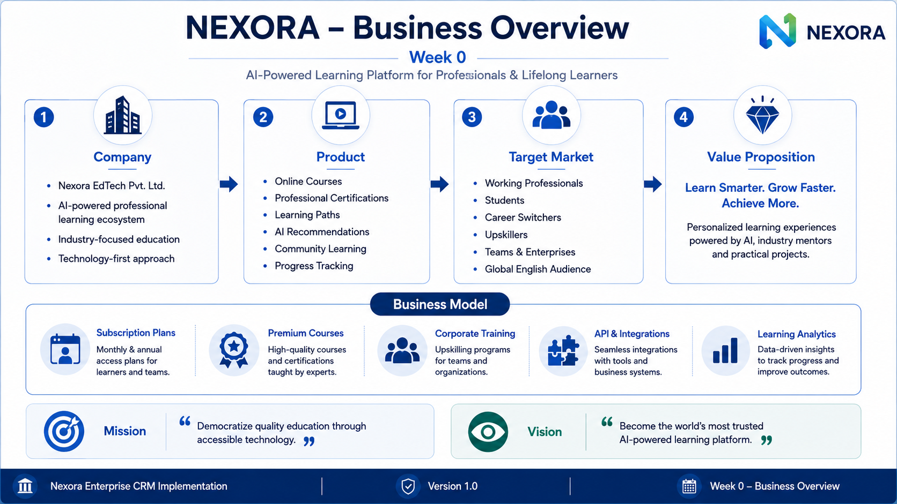
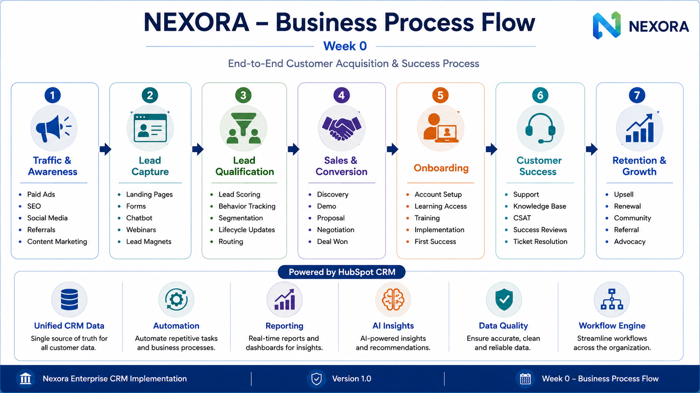
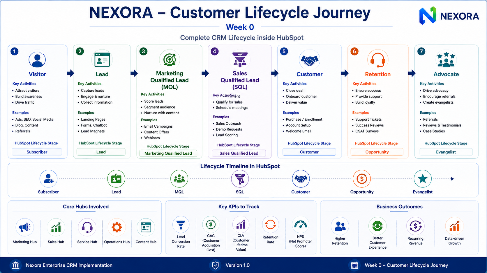
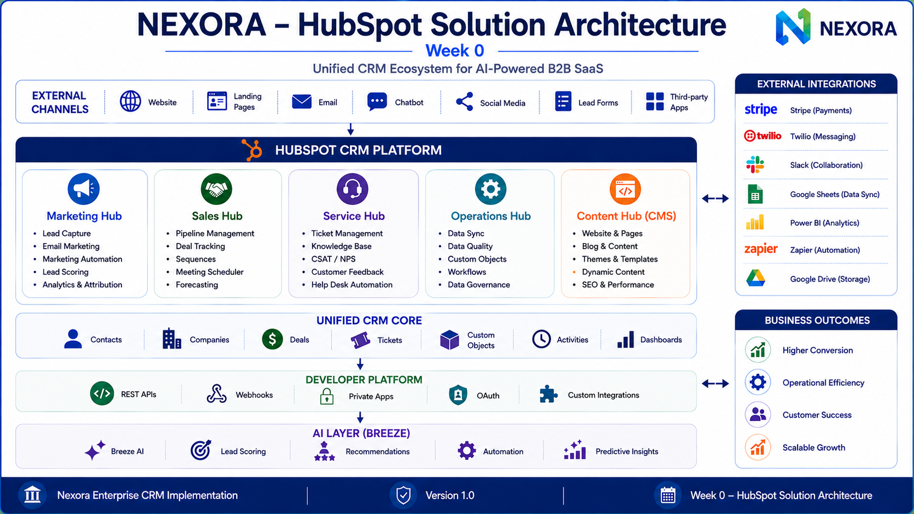
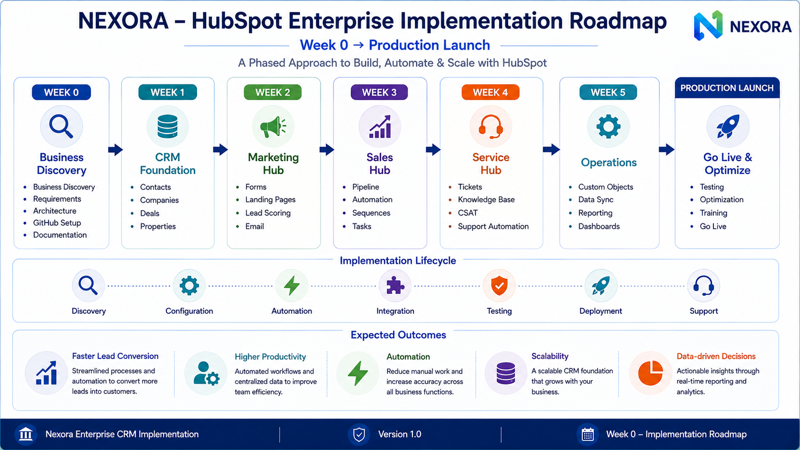

# NEXORA — HubSpot Enterprise CRM Implementation

> Enterprise-grade HubSpot CRM implementation for a fictional AI-powered EdTech SaaS company (Nexora), demonstrating how Marketing, Sales, Service, Operations, CMS, Developer Platform, and AI-powered automation work together inside a unified CRM ecosystem.

---

# Project Overview

This repository documents the complete enterprise planning and implementation blueprint for deploying HubSpot as the central CRM platform for Nexora.

The project follows a phased implementation approach, beginning with business discovery and architecture before moving into CRM configuration, automation, integrations, reporting, and production deployment.

The objective is to demonstrate enterprise CRM architecture, business process design, customer lifecycle management, and HubSpot best practices in a real-world implementation scenario.

---

# Project Objectives

- Design an enterprise HubSpot CRM architecture
- Standardize business processes
- Build a scalable CRM foundation
- Improve customer acquisition and retention
- Automate repetitive business operations
- Enable data-driven decision making
- Prepare the platform for production deployment

---

# Technology Stack

- HubSpot CRM
- Marketing Hub
- Sales Hub
- Service Hub
- Operations Hub
- Content Hub (CMS)
- HubSpot Developer Platform
- HubSpot Workflows
- HubSpot Breeze AI
- REST APIs
- Webhooks
- OAuth
- Private Apps

---

# Week 0 Deliverables

## 1. Business Overview



---

## 2. Business Process Flow



---

## 3. Customer Lifecycle Journey



---

## 4. HubSpot Solution Architecture



---

## 5. Enterprise Implementation Roadmap



---

# Repository Structure

```
assets/
└── diagrams/

docs/
└── week-0/

README.md
```

---

# Current Progress

| Phase | Status |
|-------|--------|
| Week 0 — Business Discovery | Completed |
| CRM Foundation | Planned |
| Marketing Hub | Planned |
| Sales Hub | Planned |
| Service Hub | Planned |
| Operations Hub | Planned |
| Production Launch | Planned |

---

# Disclaimer

This repository is created for educational and portfolio purposes only.

Nexora is a fictional company created to demonstrate enterprise HubSpot CRM implementation, solution architecture, automation strategy, and business process design.
