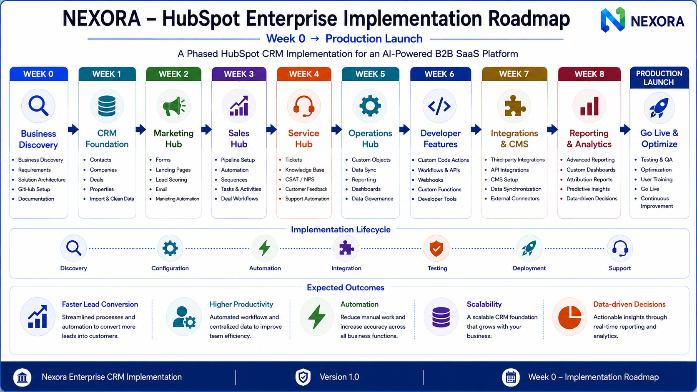

# NEXORA — HubSpot Enterprise CRM Implementation

> Enterprise-grade HubSpot CRM implementation for a fictional AI-powered B2B SaaS company (Nexora), demonstrating how Marketing, Sales, Service, Operations, CMS, Developer Platform, and AI-powered automation work together inside a unified CRM ecosystem.

---

# Project Overview

This repository documents the complete enterprise planning and implementation blueprint for deploying HubSpot as the central CRM platform for Nexora.

The project follows a phased implementation approach, beginning with business discovery and solution architecture before progressing into CRM data modeling, configuration, automation, integrations, reporting, and production deployment.

The objective is to demonstrate enterprise CRM architecture, business process design, customer lifecycle management, and HubSpot implementation best practices through a realistic end-to-end implementation scenario.

---

# Project Objectives

- Design an enterprise HubSpot CRM architecture
- Standardize business processes
- Build a scalable CRM foundation
- Improve customer acquisition and retention
- Automate repetitive business operations
- Enable data-driven decision making
- Prepare the platform for production deployment

---

# Technology Stack

**Core CRM Ecosystem:**
- HubSpot CRM (Marketing, Sales, Service, Operations, Content Hubs)
- HubSpot Breeze AI
- HubSpot Workflows & Automation

**Developer & Integration Layer:**
- REST APIs & Webhooks
- OAuth & Private Apps
- Node.js/Express (Server-side Webhook handling)
- Stripe (Multi-currency payment integration)
- OpenAI API (Custom AI product integrations)
- Zapier / External Connectors

---

# Week 0 Deliverables

## 1. Business Overview


---

## 2. Business Process Flow


---

## 3. Customer Lifecycle Journey


---

## 4. HubSpot Solution Architecture


---

## 5. Enterprise Implementation Roadmap



---

# Repository Structure

```text
assets/
├── README.md
└── diagrams/
    ├── README.md
    ├── week-0-business-overview.png
    ├── week-0-business-process-flow.png
    ├── week-0-customer-lifecycle-journey.png
    ├── week-0-hubspot-solution-architecture.png
    └── week-0-hubspot-enterprise-implementation-roadmap.png

docs/
├── README.md
└── 00_Project_Planning/
    ├── README.md
    ├── 01_Company_Overview.md
    ├── 02_Product_Definition.md
    ├── 03_Ideal_Customer_Profile.md
    ├── 04_Pricing_Model.md
    └── 05_Business_Blueprint.md

README.md
```

---

# Current Progress

| Phase | Status |
|-------|--------|
| Week 0 — Business Planning & Architecture | ✅ Completed |
| Week 1 — CRM Data Model Foundation | Planned |
| Week 2 — Multi-Source Lead Capture | Planned |
| Week 3 — Marketing Hub Deep Dive | Planned |
| Week 4 — Sales Hub Deep Dive | Planned |
| Week 5 — Service & Operations Hub | Planned |
| Week 6 — Developer Features (APIs, Webhooks) | Planned |
| Week 7 — Third-Party Integrations & CMS | Planned |
| Week 8 — Advanced Reporting & Documentation | Planned |

---

# Week 0 Status

- ✅ Business foundation established (Hybrid PLG + Sales-Led)
- ✅ Enterprise documentation & scale assumptions completed
- ✅ Business processes & compliance (GDPR/Multi-currency) defined
- ✅ Customer lifecycle designed
- ✅ HubSpot solution architecture finalized
- ✅ Enterprise implementation roadmap completed
- ✅ Visual architecture finalized
- ✅ Repository documentation completed

Week 1 begins with the CRM Foundation, where the business model established in Week 0 will be translated into HubSpot CRM objects, properties, relationships, and data architecture.

---

# Disclaimer

This repository is created for educational and portfolio purposes only.

Nexora is a fictional AI-powered B2B SaaS company created to demonstrate enterprise HubSpot CRM implementation, solution architecture, automation strategy, and business process design using realistic business requirements.
