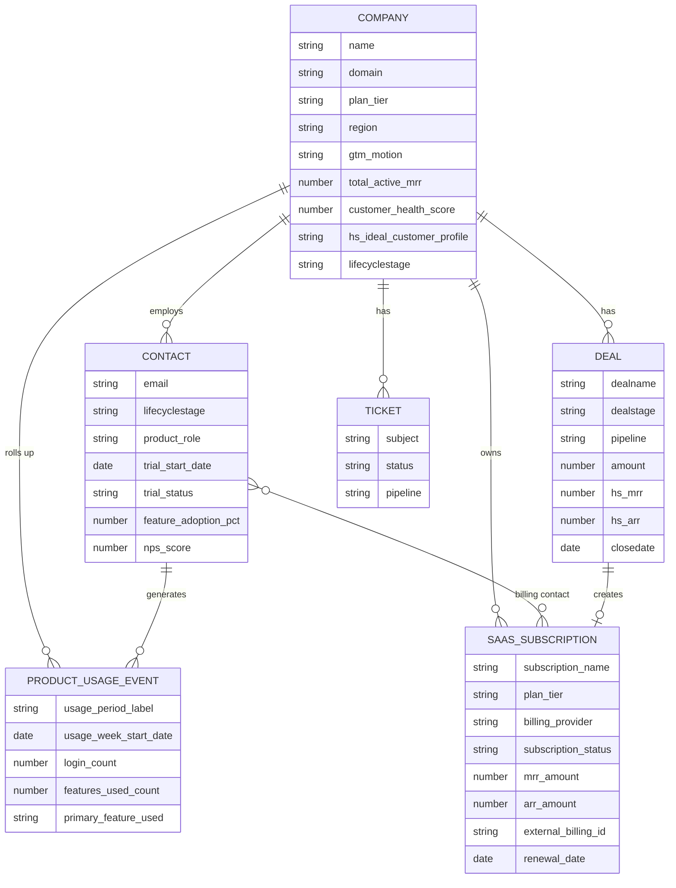
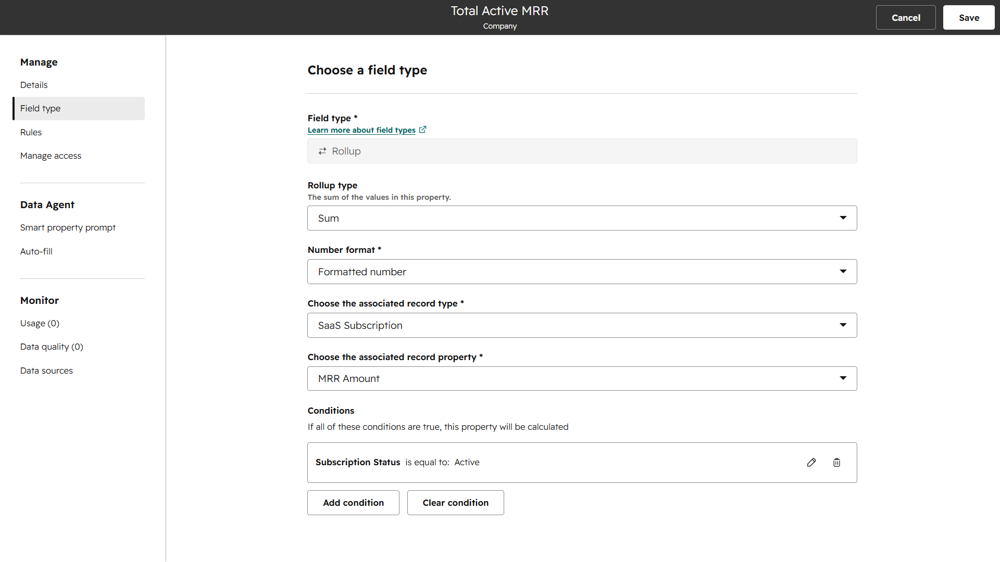

# Diagrams & Screenshot Tracking Guide

## Document Control

| Field | Detail |
|---|---|
| Document Name | Nexora, Inc. — Data Model Diagrams & Evidence Tracking |
| Phase | Week 1 — CRM Data Model Foundation |
| Version | 1.0 |
| Related Documents | `01_Architecture_Overview.md`, `02_Object_Schema_Dictionary.md` |
| Last Updated | 2026-08-12 |

---

## 1. Entity Relationship Diagram

Renders natively on GitHub (Mermaid support built into GitHub Markdown).



---

## 2. Screenshot Tracking Layout

### Suggested Folder Structure

```
docs/01_Data_Model/
├── 01_Architecture_Overview.md
├── 02_Object_Schema_Dictionary.md
├── 03_Data_Governance_Rules.md
├── 04_Diagrams_And_Screenshots.md
└── screenshots/
    ├── 01_custom_objects_list.png
    ├── 02_saas_subscription_object_settings.png
    ├── 03_product_usage_event_object_settings.png
    ├── 04_company_properties_groups_view.png
    ├── 05_contact_properties_groups_view.png
    ├── 06_calc_arr_amount_config.png
    ├── 07_rollup_total_active_mrr_config.png
    └── 08_external_billing_id_unique_constraint.png
```

### Capture Mapping

| Filename | What to Capture | Supports |
|---|---|---|
| `01_custom_objects_list.png` | Settings → Objects → Custom Objects, showing both SaaS Subscription and Product Usage Event listed | `01_Architecture_Overview.md` §2 |
| `02_saas_subscription_object_settings.png` | SaaS Subscription object config screen — primary display property, enabled associations | `01_Architecture_Overview.md` §3 |
| `03_product_usage_event_object_settings.png` | Product Usage Event object config screen | `01_Architecture_Overview.md` §3 |
| `04_company_properties_groups_view.png` | Company property groups list showing Business Info, Subscription & Billing, Compliance & Consent, Support & Success | `02_Object_Schema_Dictionary.md` §1 |
| `05_contact_properties_groups_view.png` | Contact property groups list | `02_Object_Schema_Dictionary.md` §2 |
| `06_calc_arr_amount_config.png` | ARR Amount property editor showing the Custom Equation and the **green "No issues" validation indicator** | `03_Data_Governance_Rules.md` §1.1 |
| `07_calc_trial_days_remaining_chain.png` | Both `trial_days_elapsed` and `trial_days_remaining` property configs, side by side or sequential | `03_Data_Governance_Rules.md` §1.2 |
| `08_rollup_total_active_mrr_config.png` | Total Active MRR rollup config showing Sum type, associated object = SaaS Subscription, and the Additional Condition filter (`subscription_status = Active`) | `03_Data_Governance_Rules.md` §1.3 |
| `09_calc_customer_health_score_equation.png` | Customer Health Score equation builder showing the full weighted formula, green validation indicator | `03_Data_Governance_Rules.md` §1.4 |
| `10_external_billing_id_unique_constraint.png` | `external_billing_id` property editor showing "Require unique value" toggled on | `03_Data_Governance_Rules.md` §3.2 |
| `11_sample_saas_subscription_record.png` | One populated sample SaaS Subscription record, showing associations panel (Company, Contact, Deal) | `01_Architecture_Overview.md` §3 |

**Usage note:** Each `.md` file in this folder should embed its relevant screenshot(s) inline using standard Markdown image syntax once captured, e.g.:

```markdown

```
